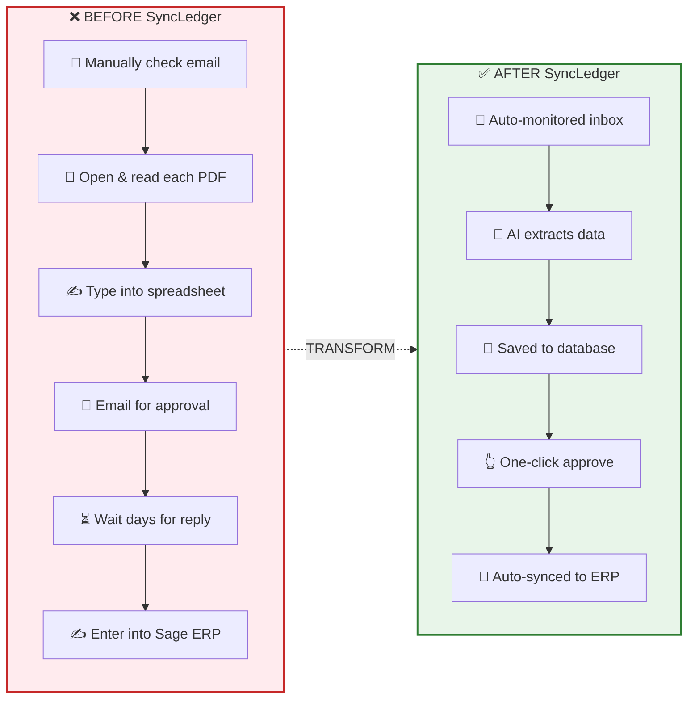
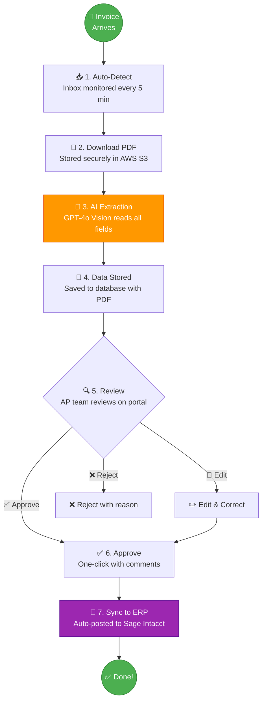
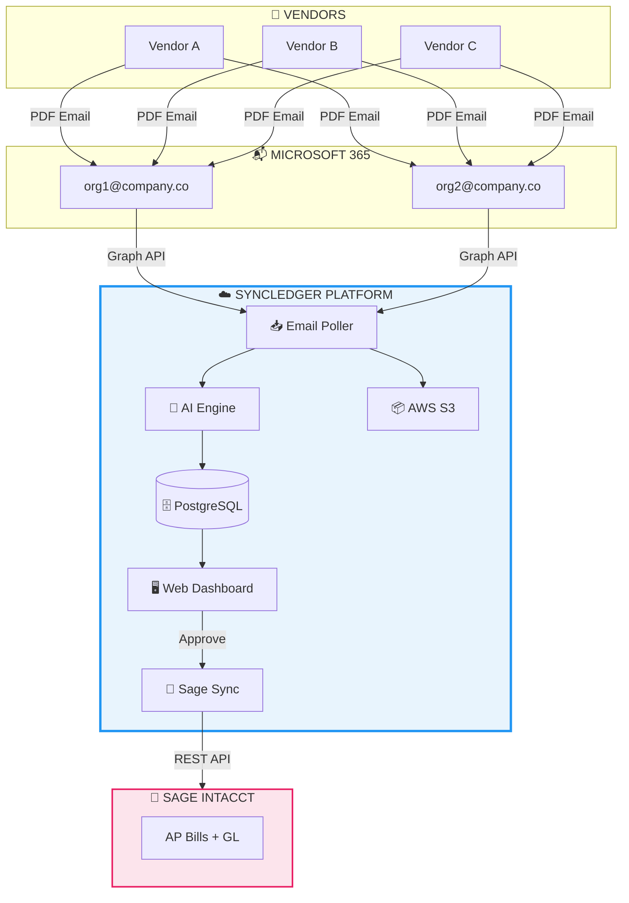
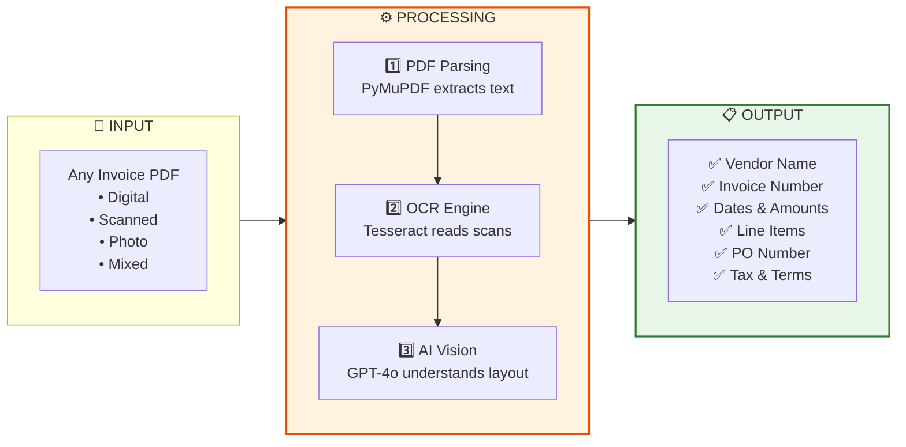
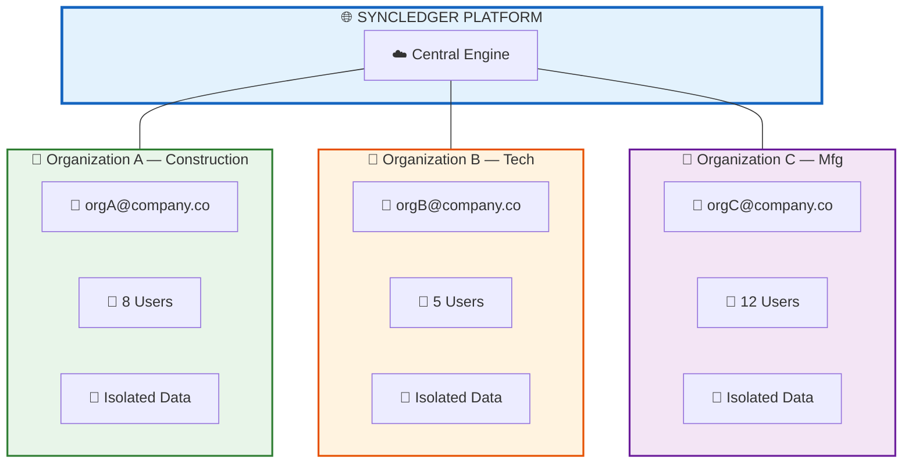
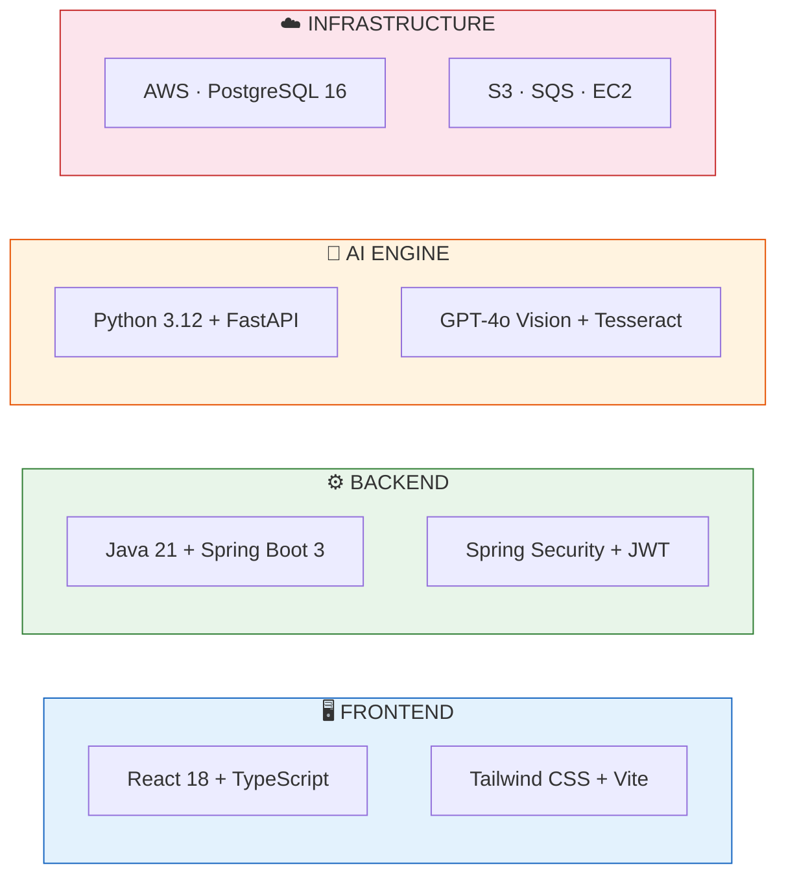

<!-- _class: lead -->
<!-- _backgroundColor: #0D47A1 -->
<!-- _color: white -->

# **SyncLedger**

## Stop Processing Invoices Manually. Let AI Do It.

### AI-Powered Invoice Processing Automation Platform

> *"From 100s of invoice emails to ERP postings — in minutes, not days."*

**by Vedvix (Nevorix)**

---

# 📋 Agenda

| # | Topic |
|:-:|:------|
| 1 | The Problem — Why Invoice Processing is Broken |
| 2 | The Solution — What SyncLedger Does |
| 3 | Before vs. After — The Transformation |
| 4 | How It Works — 7 Simple Steps |
| 5 | System Architecture |
| 6 | AI-Powered Extraction |
| 7 | The Dashboard — Product Demo |
| 8 | Multi-Tenant SaaS Model |
| 9 | Security & Compliance |
| 10 | Pricing Plans |
| 11 | ROI & Cost Savings |
| 12 | Getting Started |

---

<!-- _class: lead -->
<!-- _backgroundColor: #B71C1C -->
<!-- _color: white -->

# SLIDE 1

## 📌 The Problem
### Invoice Processing is Broken

---

# 📌 The Problem: Manual Invoice Processing

Every business receives invoices. Every business processes them the same painful way.

| Step | Manual Task | Time |
|:----:|:------------|:----:|
| 1 | 📧 Check email for invoices | 5-10 min |
| 2 | 📄 Open each PDF and read it | 5-8 min |
| 3 | ✍️ Type data into a spreadsheet | 5-7 min |
| 4 | 📧 Forward to manager for approval | 2-3 min |
| 5 | ⏳ Wait for email reply | **1-3 DAYS** |
| 6 | ✍️ Manually enter into Sage/ERP | 5-10 min |

> **⏱️ TOTAL: 15-30 minutes PER INVOICE + days of waiting**
> × 500 invoices/month = **125-250 HOURS wasted**

---

# 📌 The Real Cost of Manual Processing

| Pain Point | Business Impact |
|:-----------|:----------------|
| ⏱️ **Time Waste** | AP staff spend 60-70% of their time on data entry, not analysis |
| ❌ **Human Errors** | 3-5% error rate in manual data entry = costly corrections |
| 📭 **Lost Invoices** | Emails get buried, attachments missed = late payment penalties |
| 🔍 **No Visibility** | "Where is that invoice?" — no one knows the status |
| 📋 **No Audit Trail** | Who approved what? When? No record exists |
| 🐌 **Slow Approvals** | Email chains for approvals take days, sometimes weeks |
| 📈 **Scaling Problem** | Hire more people as invoice volume grows? Not sustainable |

> **This costs companies $15-25 per invoice in labor alone.**

---

<!-- _class: lead -->
<!-- _backgroundColor: #1B5E20 -->
<!-- _color: white -->

# SLIDE 2

## 💡 The Solution
### Introducing SyncLedger

---

# 💡 SyncLedger — The Solution

**SyncLedger automates the entire invoice lifecycle** — from the moment an invoice lands in your email to when it's posted in your accounting system.

### What SyncLedger Does

| Capability | Description |
|:-----------|:------------|
| 📧 **Email Monitoring** | Auto-reads invoices from your dedicated email inbox |
| 🤖 **AI PDF Extraction** | Reads ANY invoice format — digital, scanned, even handwritten |
| 💾 **Smart Data Storage** | All extracted data stored with original PDF linked |
| ✅ **Approval Workflow** | One-click approve/reject on a web portal |
| 🔗 **ERP Integration** | Auto-posts approved invoices to Sage Intacct |
| 📊 **Real-Time Dashboard** | Know the status of every invoice, instantly |
| 🔒 **Audit Trail** | Complete history of every action taken |

---

<!-- _class: lead -->
<!-- _backgroundColor: #E65100 -->
<!-- _color: white -->

# SLIDE 3

## 🔄 Before vs. After
### The Transformation

---

# 🔄 Before vs. After SyncLedger



---

# 📊 The Numbers That Matter

|  | ❌ Manual Process | ✅ SyncLedger |
|:-|:-----------------|:-------------|
| **Time per Invoice** | 15-30 minutes | 1-3 minutes |
| **Accuracy** | 3-5% error rate | 97%+ accuracy |
| **Approval Speed** | Days via email | Instant — one click |
| **Visibility** | No tracking | Real-time dashboard |
| **Audit Trail** | None | Complete history |
| **Cost per Invoice** | $15-25 | $0.08-0.15 |

### Impact Summary

> **80% FASTER · 95% FEWER ERRORS · 70% COST SAVINGS**

---

<!-- _class: lead -->
<!-- _backgroundColor: #4A148C -->
<!-- _color: white -->

# SLIDE 4

## 🔄 How It Works
### 7 Simple Steps

---

# 🔄 How It Works — The 7-Step Flow



---

# 🔄 Each Step Explained

| Step | What Happens | Who Does It |
|:----:|:-------------|:------------|
| **1** | Vendors send invoices to your email — just like today | Vendors (no change) |
| **2** | SyncLedger detects new emails with PDF attachments | 🤖 Automated |
| **3** | AI reads the entire PDF — vendor, amounts, dates, line items | 🤖 Automated |
| **4** | Extracted data saved to database with original PDF linked | 🤖 Automated |
| **5** | Your AP team reviews data side-by-side with the PDF | 👤 Your Team |
| **6** | One click to approve, edit, or reject with a reason | 👤 Your Team |
| **7** | Approved invoices auto-posted to Sage Intacct with GL codes | 🤖 Automated |

> ### 🎯 5 of 7 steps are fully automated. Your team only reviews and clicks Approve.

---

<!-- _class: lead -->
<!-- _backgroundColor: #0D47A1 -->
<!-- _color: white -->

# SLIDE 5

## 🏗️ System Architecture
### How It All Connects

---

# 🏗️ System Architecture



---

# 🏗️ Architecture in Simple Terms

| Component | What It Does | Think of It As... |
|:----------|:-------------|:------------------|
| **📬 Email Inbox** | Receives invoices from vendors | Your digital mailbox — vendors email here like before |
| **📥 Email Poller** | Checks for new invoices every 5 min | A tireless assistant checking mail 24/7 |
| **🤖 AI Engine** | Reads PDFs and extracts all data | A super-fast accountant: 1,000 invoices/hour |
| **🖥️ Dashboard** | Review, approve, or reject invoices | Your invoice command center |
| **🔗 Sage Sync** | Sends approved data to your ERP | A bridge to your accounting system |
| **🗄️ Database** | Stores all data and audit logs | Your secure digital filing cabinet |
| **📦 S3 Storage** | Stores all original PDF files | A fireproof vault for every invoice |

---

<!-- _class: lead -->
<!-- _backgroundColor: #E65100 -->
<!-- _color: white -->

# SLIDE 6

## 🤖 AI-Powered Extraction
### The Intelligence Behind SyncLedger

---

# 🤖 Traditional vs. SyncLedger AI

| | ❌ Traditional (Template-Based) | ✅ SyncLedger (AI-Powered) |
|:-|:-------------------------------|:---------------------------|
| **Vendor Formats** | 📐 Needs a template for every vendor | 🤖 Reads ANY format automatically |
| **Layout Changes** | ❌ Breaks when vendors change layout | ✅ Adapts to new formats instantly |
| **Scanned PDFs** | ❌ Can't read scanned/handwritten | ✅ Reads scanned, photos, handwritten |
| **New Vendors** | ❌ Requires IT setup per vendor | ✅ Zero configuration needed |
| **Accuracy** | ❌ 70-80% accuracy | ✅ **97%+ accuracy** |

> **Powered by GPT-4o Vision** — the most advanced document AI available.

---

# 🤖 AI Extraction Pipeline



> **🎯 Works with 100+ different vendor formats — ZERO configuration**

---

# 🤖 What the AI Extracts

| Field | Example | Accuracy |
|:------|:--------|:--------:|
| **Vendor Name** | "Acme Building Supplies Inc." | 99% |
| **Invoice Number** | "INV-2026-0847" | 99% |
| **Invoice Date** | "February 15, 2026" | 98% |
| **Due Date** | "March 15, 2026" | 97% |
| **Subtotal** | "$12,450.00" | 99% |
| **Tax Amount** | "$996.00" | 98% |
| **Total Amount** | "$13,446.00" | 99% |
| **PO Number** | "PO-4521" | 96% |
| **Line Items** | Material, quantity, unit price, total | 95% |
| **Payment Terms** | "Net 30" | 97% |

---

<!-- _class: lead -->
<!-- _backgroundColor: #1565C0 -->
<!-- _color: white -->

# SLIDE 7

## 🖥️ The Dashboard
### Your Invoice Command Center

---

# 🖥️ What Your Team Sees

```
┌─────────────────────────────────────────────────────────────────────┐
│  SyncLedger                                    👤 Mary (Approver)  │
├──────────┬──────────────────────────────────────────────────────────┤
│          │  INVOICE DASHBOARD                       Feb 2026       │
│ 📊 Dash  │                                                        │
│ 📄 Inv   │  ┌────────┐ ┌────────┐ ┌────────┐ ┌────────┐          │
│ ✅ Apprvl│  │ Total  │ │Pending │ │Approved│ │Rejected│          │
│ 👥 Users │  │  247   │ │  23    │ │  198   │ │  26    │          │
│ ⚙️ Setup │  └────────┘ └────────┘ └────────┘ └────────┘          │
│          │                                                        │
│          │  RECENT INVOICES                                       │
│          │  ┌──────────────────────────────────────────────────┐  │
│          │  │ Vendor        │ Amount   │ Date   │ Status      │  │
│          │  ├───────────────┼──────────┼────────┼─────────────┤  │
│          │  │ Acme Supplies │ $13,446  │ Feb 15 │ ⏳ Pending  │  │
│          │  │ BuildCo Inc   │ $8,230   │ Feb 14 │ ✅ Approved │  │
│          │  │ Steel Works   │ $45,100  │ Feb 14 │ ✅ Synced   │  │
│          │  │ Electric Plus │ $2,180   │ Feb 13 │ ❌ Rejected │  │
│          │  └──────────────────────────────────────────────────┘  │
│          │  Click any invoice → View PDF → Approve in 1 click    │
└──────────┴────────────────────────────────────────────────────────┘
```

---

# 🖥️ Key Dashboard Features

| Feature | Description |
|:--------|:------------|
| 📊 **Real-Time Dashboard** | All invoices, statuses, and KPIs at a glance |
| 📄 **Side-by-Side View** | Original PDF next to extracted data — compare instantly |
| ✅ **One-Click Approval** | Approve or reject with a single click + optional comments |
| ✏️ **Inline Editing** | Fix any field right on the portal — no re-upload needed |
| 🔍 **Smart Search & Filter** | Find invoices by vendor, date, amount, status, or PO number |
| 📥 **Excel Export** | Download invoice data with custom columns & filters |
| 👥 **User Management** | Add team members with specific roles |
| 📋 **Full Audit Trail** | Every action logged — who did what, and when |

---

<!-- _class: lead -->
<!-- _backgroundColor: #4A148C -->
<!-- _color: white -->

# SLIDE 8

## 🏢 Multi-Tenant SaaS
### Built for Multiple Organizations

---

# 🏢 Multi-Tenant Architecture



---

# 🏢 What Each Organization Gets

| Feature | Details |
|:--------|:--------|
| 📧 **Dedicated Email Inbox** | Each org has its own inbox — vendors email invoices here |
| 🔒 **Complete Data Isolation** | Org A **cannot** see Org B's data — ever |
| 👥 **Independent Users & Roles** | Each org manages its own users and permissions |
| 📦 **Separate Storage** | PDFs stored in isolated folders per organization |
| 📊 **Own Dashboard & Reports** | Each org has its own dashboard and audit trail |
| 🔗 **Own ERP Connection** | Each org connects to its own Sage Intacct instance |

### Role Hierarchy

| Role | Scope | Permissions |
|:-----|:------|:------------|
| 🔑 **Super Admin** | Platform-wide | Manage all orgs, users, and settings |
| 👔 **Admin** | Organization | Manage org users, approve invoices, configure Sage |
| ✅ **Approver** | Organization | Review, edit, approve/reject invoices |
| 👁️ **Viewer** | Organization | View-only access to invoices and reports |

---

<!-- _class: lead -->
<!-- _backgroundColor: #1B5E20 -->
<!-- _color: white -->

# SLIDE 9

## 🛡️ Security & Compliance
### Enterprise-Grade Protection

---

# 🛡️ Security & Compliance

| Category | Features |
|:---------|:---------|
| **🔐 Authentication** | JWT-based secure auth, Role-based access control (RBAC), Multi-tenant data isolation, Session auto-expiry |
| **🔒 Data Protection** | Encryption in transit (TLS 1.2+), Encryption at rest (AES-256), Secure PDF storage in AWS S3, Org-scoped isolation |
| **📋 Audit & Compliance** | Complete audit trail for every action, Who approved/rejected with timestamps, Data change history, Exportable logs |
| **☁️ Infrastructure** | AWS Cloud hosting, Automatic daily backups, 99.5–99.9% uptime SLA, 24/7 monitoring |

---

# 🔧 Technology Stack



| Layer | Technology | Why |
|:------|:-----------|:----|
| **Frontend** | React 18 + TypeScript + Tailwind | Fast, modern, responsive UI |
| **Backend** | Java 21 + Spring Boot 3 | Enterprise reliability & security |
| **AI Engine** | Python 3.12 + FastAPI + GPT-4o | Best-in-class document AI |
| **Infrastructure** | AWS + PostgreSQL + S3 + SQS | Scalable, secure cloud |

---

<!-- _class: lead -->
<!-- _backgroundColor: #E65100 -->
<!-- _color: white -->

# SLIDE 10

## 💰 Pricing Plans
### For Every Business Size

---

# 💰 Pricing Plans

| | 🌱 Starter | 🚀 Professional | 🏢 Business | 🏗️ Enterprise |
|:-|:----------:|:---------------:|:-----------:|:-------------:|
| **Monthly** | **$349** | **$649** | **$799** | **$1,499** |
| **Annual** | $3,490 | $6,490 | $7,990 | $14,990 |
| **Invoices/mo** | 1,000 | 5,000 | 10,000 | 20,000+ |
| **Users** | 3 | 15 | 30 | Unlimited |
| **Organizations** | 1 | 3 | 5 | Unlimited |
| **Email Inboxes** | 1 | 3 | 5 | Unlimited |
| **Storage** | 50GB | 200GB | 500GB | Unlimited |
| **Approval** | Basic | Multi-level | Custom | Custom |
| **Support** | Email (24hr) | Priority (4hr) | Dedicated (2hr) | 24/7 (1hr) |
| **Uptime SLA** | 99.5% | 99.7% | 99.8% | 99.9% |

> **Annual billing saves 2 months free (16.7% discount)**

---

# 💡 Build vs. Buy — 2-Year Comparison

| Cost Category | ❌ Self-Build | ✅ SyncLedger |
|:--------------|:-------------|:-------------|
| Upfront Development | $77,250+ | **$0** |
| Monthly Infrastructure | $2,000-4,000/mo | **Included** |
| Developer Maintenance | $3,000-5,000/mo | **Included** |
| DevOps Cost | $1,000-2,000/mo | **Included** |
| AI API Costs | $500-2,000/mo | **Included** |
| Time to Deploy | 14-18 weeks | **1-2 weeks** |
| **2-YEAR TOTAL** | **$230,500-$609,800** | **$11,878-$45,976** |

> ### 💰 SAVINGS: UP TO 93% with SyncLedger subscription!

---

<!-- _class: lead -->
<!-- _backgroundColor: #1565C0 -->
<!-- _color: white -->

# SLIDE 11

## 📈 ROI & Cost Savings
### What You'll Save

---

# 📈 ROI Calculator

### Example: Company processing **500 invoices/month**

| | Current (Manual) | With SyncLedger |
|:-|:-----------------|:----------------|
| **Monthly labor cost** | 500 inv × 20 min × $30/hr = **$5,000** | Included in plan |
| **Annual labor cost** | **$60,000** | **$6,490** (Pro plan) |
| **Late payment penalties** | ~$3,000/year | ~$0 |
| **Error correction costs** | ~$5,000/year | ~$0 |
| **TOTAL ANNUAL COST** | **~$68,000** | **~$8,990** (Year 1) |

### Results

| Metric | Savings |
|:-------|:--------|
| 💰 **Year 1 Savings** | **$59,010** (86.8%) |
| 💰 **Year 2+ Savings** | **$61,510/year** (90.5%) |
| ⏱️ **Time Saved** | **150+ hours/month** for your AP team |
| ❌ **Errors Eliminated** | 95%+ reduction |
| ⚡ **Processing Speed** | 80% faster |

---

<!-- _class: lead -->
<!-- _backgroundColor: #4A148C -->
<!-- _color: white -->

# SLIDE 12

## 🏆 Why SyncLedger?
### 8 Reasons to Choose Us

---

# 🏆 Why Choose SyncLedger?

| # | Differentiator | Details |
|:-:|:---------------|:--------|
| 1 | 🤖 **AI-First Approach** | GPT-4o Vision reads ANY format — no templates. 97%+ accuracy. |
| 2 | ⚡ **Zero Vendor Friction** | Vendors keep emailing invoices — no portal, no EDI, no changes |
| 3 | 🔒 **Enterprise Security** | Multi-tenant isolation, encryption everywhere, full audit trail |
| 4 | 🔗 **Seamless ERP Sync** | One-click approve → auto-posted to Sage with correct GL codes |
| 5 | 📊 **Complete Visibility** | Real-time dashboard — never lose an invoice again |
| 6 | 🚀 **Fast Deployment** | Live in 1-2 weeks, not months. No IT infrastructure to manage. |
| 7 | 💰 **Predictable Pricing** | Flat monthly fee. 93%+ savings vs. building your own. |
| 8 | 📈 **Scales With You** | From 100 to 20,000+ invoices/month. Upgrade as you grow. |

---

<!-- _class: lead -->
<!-- _backgroundColor: #1B5E20 -->
<!-- _color: white -->

# SLIDE 13

## 🚀 Getting Started
### Go Live in 2 Weeks

---

# 🚀 Getting Started — 2-Week Onboarding

| | Week 1 | Week 2 | Go Live! |
|:-|:-------|:-------|:---------|
| **Activities** | 📋 Kickoff call | 🔧 Configure mapping rules | 🚀 Start processing |
| | 📧 Connect email inbox | 🧪 Test with real invoices | 📊 Monitor dashboard |
| | 👥 Create user accounts | 📝 Refine AI rules | ✅ Approve invoices |
| | 📄 Send sample invoices | ✅ Pilot sign-off | 🔗 Auto-sync to Sage |

### What We Need From You

| # | Item | When |
|:-:|:-----|:-----|
| 1 | 10-15 sample invoices (varied vendor formats) | Week 1 |
| 2 | Microsoft 365 email access for dedicated inbox | Week 1 |
| 3 | Sage Intacct API credentials (test environment) | Week 1 |
| 4 | GL coding rules and approval workflow preferences | Week 2 |
| 5 | Sign off on pilot results | Week 2 |

---

# 📊 Success Metrics We Guarantee

| Metric | Target |
|:-------|:------:|
| First-pass extraction accuracy | **97%+** |
| Manual data entry reduction | **90%+** |
| Invoice cycle time reduction | **80%+** |
| Exception rate (needs human fix) | **< 15%** |
| System uptime | **99.5%+** |
| Time from signup to go-live | **< 2 weeks** |

---

# ❓ Frequently Asked Questions

| Question | Answer |
|:---------|:-------|
| **Do vendors need to change anything?** | No. They keep emailing invoices — no change. |
| **What if the AI gets something wrong?** | Your team reviews every invoice. Any field can be edited inline. |
| **How accurate is the AI?** | 97%+ accuracy using GPT-4o Vision. |
| **Can it read scanned/photo PDFs?** | Yes — digital, scanned, and even photos. |
| **How long to get started?** | 1-2 weeks from signup to live invoices. |
| **Is my data secure?** | Enterprise-grade encryption + data isolation on AWS. |
| **What ERPs do you support?** | Sage Intacct today. QuickBooks, Xero, NetSuite coming soon. |
| **What if I exceed my invoice limit?** | Invoices keep processing — overages billed transparently. |

---

<!-- _class: lead -->
<!-- _backgroundColor: #0D47A1 -->
<!-- _color: white -->

# 📞 Ready to Automate Your Invoices?

### Stop spending hours on manual data entry.
### Let SyncLedger's AI handle it in minutes.

<br/>

📧 **Contact:** sales@syncledger.com
🌐 **Website:** www.syncledger.com
📅 **Book a Demo:** calendly.com/syncledger

<br/>

> *"From 100s of emails to ERP — automatically."*

**SyncLedger by Vedvix**
*Empowering Financial Operations Through Intelligent Automation*

---

<!-- _class: lead -->
<!-- _backgroundColor: #0D47A1 -->
<!-- _color: white -->

# Thank You

### Questions?

*Document Version: 1.0 | February 2026*
