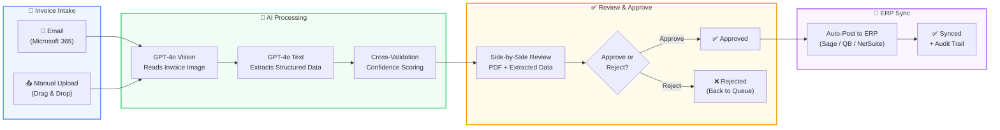
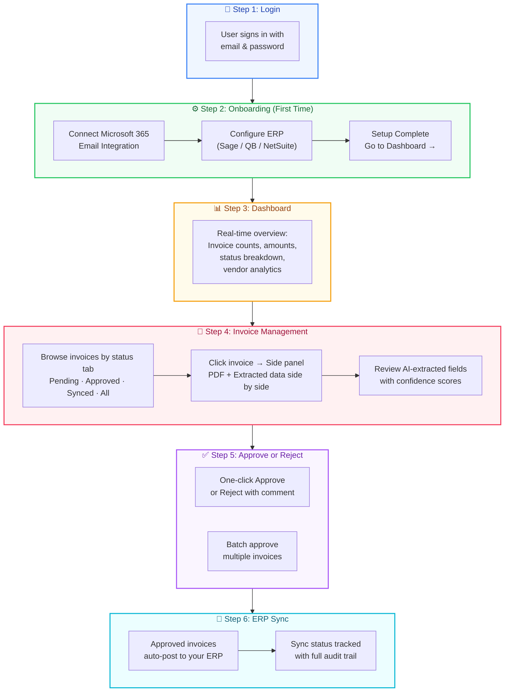
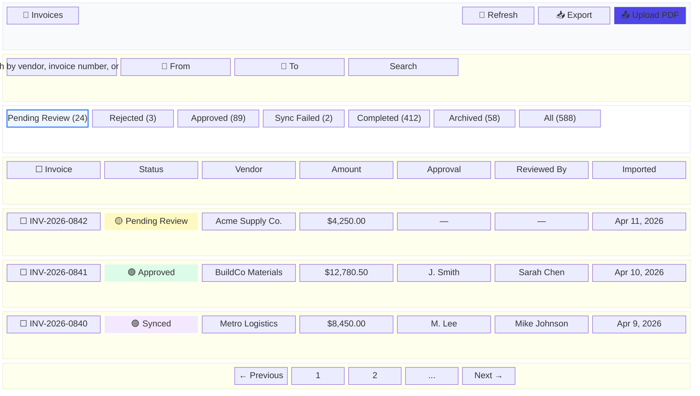
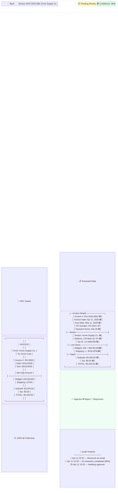

# SyncLedger — Product Overview

### AI-Powered Invoice Processing & Accounts Payable Automation

---

## The Problem

Every growing business faces the same AP bottleneck:

- **Manual data entry** — Staff spend 15–30 minutes per invoice keying data into spreadsheets or ERPs.
- **Slow approvals** — Paper trails and email chains stretch invoice cycles to 2–7 days.
- **Costly errors** — Manual processes yield ~15% error rates, leading to duplicate payments, missed discounts, and audit failures.
- **No visibility** — Finance leaders lack real-time insight into outstanding liabilities and cash flow.
- **Scaling pain** — As invoice volume grows, the only option is to hire more AP clerks.

**The result:** Wasted labor, late-payment penalties, strained vendor relationships, and finance teams buried in paperwork instead of strategy.

---

## The Solution: SyncLedger

SyncLedger is a **cloud-based, AI-powered platform** that automates the entire invoice lifecycle — from receipt to ERP posting — in minutes instead of days.

```
Invoice Arrives  →  AI Reads & Extracts  →  Team Reviews & Approves  →  Auto-Posts to ERP
   (Email/Upload)     (GPT-4o Vision)          (One-Click Workflow)        (Sage, QB, NetSuite...)
```

Your AP team stops doing data entry and starts doing what matters: **reviewing, approving, and controlling spend.**

### End-to-End Processing Flow



---

## How It Works

### 1. Invoices Arrive Automatically

SyncLedger monitors a dedicated **Microsoft 365 inbox** every 5 minutes. PDF invoices attached to incoming emails are automatically detected, downloaded, and queued for processing — with zero manual intervention.

Invoices can also be **uploaded manually** via drag-and-drop (PDF, JPG, PNG, TIFF supported).

### 2. AI Reads Every Invoice

Our **3-tier AI extraction engine** analyzes each invoice:

| Tier | Technology | Role |
|------|-----------|------|
| **Primary** | GPT-4o Vision | Reads the invoice as an image — understands any layout, any vendor, any language |
| **Secondary** | GPT-4o Text | Extracts structured data from embedded text layers |
| **Validation** | Pattern Matching | Cross-validates results and calculates confidence scores |

**What gets extracted:**

- Vendor name, address, email, tax ID
- Invoice number, date, due date
- Line items with descriptions, quantities, unit prices
- Subtotal, tax, total amount, currency
- PO number, payment terms
- GL account codes, project/job codes, cost centers

**No templates required.** SyncLedger understands any invoice format from any vendor on the first encounter — including scanned documents and handwritten invoices.

### 3. Your Team Reviews & Approves

Invoices appear in a clean, **side-by-side review interface**:

- **Left panel:** Full PDF viewer with zoom and fullscreen controls
- **Right panel:** AI-extracted data with color-coded confidence scores (High / Medium / Low)

Reviewers can:

- Edit any field inline if a correction is needed
- Approve with one click
- Reject with a required comment (routed back for resubmission)
- Batch-approve multiple invoices at once

**Configurable approval rules** support multi-level chains, amount thresholds (e.g., invoices over $10K require two approvers), and routing by vendor, department, or project.

### 4. Approved Invoices Sync to Your ERP

Once approved, invoices **automatically post** to your accounting system:

| ERP System | Integration |
|-----------|-------------|
| **Sage Intacct** | Production-ready — AP bills, dimensional posting, multi-entity support |
| **QuickBooks** | Bills and accounts payable |
| **NetSuite** | Vendor bills and subsidiaries |
| **Oracle** | Purchase invoices and GL journals |
| **SAP** | Vendor invoices and cost allocation |
| **Xero** | Bills and invoice sync |
| **Custom API** | REST/JSON/XML for proprietary systems |

**What syncs per invoice:** Vendor ID, invoice number, dates, line items with GL codes, project codes, department codes, tax assignments, and a complete audit link.

Failed syncs automatically retry with exponential backoff (3 attempts). Manual retry is always available. Every sync attempt is logged with request, response, duration, and result.

---

## Product Walkthrough

The following screens illustrate the user journey through SyncLedger — from login to ERP sync.

### User Journey Overview



---

### Screen 1: Login

The login screen features a **split-panel layout**:

- **Left panel** — Marketing showcase with gradient background, three feature highlight cards (AI-Powered Extraction, Approval Workflows, Real-time Analytics), and social proof metrics (99%+ accuracy, 80% time saved, 24/7 auto email polling).
- **Right panel** — Clean sign-in form with email, password (show/hide toggle), and error handling.

First-time users are guided through a **3-step onboarding wizard**: connect Microsoft 365 email, configure ERP credentials, and start processing.

---

### Screen 2: Dashboard


The dashboard is the command center for your AP team. Key features:

- **Personalized greeting** with time-of-day awareness and role-based context
- **At-a-glance stats** — total invoices, pending count, approved count, total dollar value
- **Customizable widget grid** — drag-and-drop charts including pie charts (status breakdown), bar charts (monthly volume, top vendors), area charts (financial trends), and metric cards (sync performance, email processing stats)
- **Date filtering toolbar** — Today, This Week, This Month, or custom date range
- **Auto-refresh** every 30 seconds for real-time data

---

### Screen 3: Invoice List



The invoice list is the central hub for managing all invoices:

- **7 status tabs** with live counts — Pending Review, Rejected, Approved, Sync Failed, Completed, Archived, All
- **Color-coded status badges** — Yellow (Pending), Green (Approved), Purple (Synced), Red (Rejected), Orange (Sync Failed)
- **Full-text search** by vendor name, invoice number, PO number, or amount
- **Date range filters** and vendor autocomplete
- **Bulk selection** with checkboxes for batch actions
- **Upload button** with drag-and-drop support (PDF, JPG, PNG, TIFF)
- **Export to Excel** with column selection and filter preservation

---

### Screen 4: Invoice Detail — Side-by-Side Review



This is where invoice review happens — the most critical screen in SyncLedger:

- **Left panel** — Embedded PDF viewer with zoom controls (100%–200%) and fullscreen toggle. See the original invoice exactly as received.
- **Right panel** — AI-extracted data organized by section (Invoice Details, Vendor, Line Items, Totals). Each field shows a **confidence indicator** (🟢 High ≥90%, 🟡 Medium 70–89%, 🔴 Low <70%).
- **Inline editing** — Click any field to correct it before approval.
- **Action buttons** — Approve (green), Reject with reason (red), or Reprocess through AI again.
- **Audit timeline** — Full history of every event: received, extracted, reviewed, approved, synced — with who, when, and what changed.

---

### Screen 5: Vendor Analytics

The vendor management screen provides:

- **Summary cards** — Total vendors, total spend, active this month, average invoices per vendor
- **Searchable vendor directory** — Name, code, email, phone, total spend
- **Vendor detail profiles** — Contact info, payment terms, spend analytics, monthly volume charts, and linked invoices
- **Create/edit vendor** — Full contact form with tax ID and payment terms

---

### Screen 6: Organization Settings

Administrators manage their organization through a **6-tab configuration panel**:

- **Overview** — Organization name, status (Trial / Active / Suspended)
- **Users** — Add, edit, and manage team members with role assignment (Admin, Approver, Viewer)
- **Subscription** — Current plan, usage vs. limits with visual progress bars, upgrade options
- **Integrations** — Microsoft 365 email setup and ERP system configuration
- **AI Usage** — Token usage statistics and cost breakdown with charts
- **Field Mapping** — Custom extraction rules per vendor with conditions, transforms, and date calculations

---

## The Dashboard & Analytics

SyncLedger provides a **real-time, customizable dashboard** that refreshes every 30 seconds:

### Key Metrics at a Glance

- **Invoice volume** — Total, pending, approved, processing counts
- **Financial summary** — Total amount, pending amount, approved amount, synced amount
- **Email processing** — Processed today, unprocessed, errors
- **Sync performance** — Success rate, failed syncs, average sync time

### Interactive Charts & Widgets

- **Invoices by Status** — Pie chart breakdown
- **Monthly Invoice Volume** — Trend analysis (bar/area chart)
- **Top Vendors by Spend** — Ranked bar chart
- **Financial Trends** — Amount over time (area chart)
- **Email Processing Metrics** — Real-time stats
- **Sync Performance** — Success rates and throughput

Widgets are **drag-and-drop customizable** — add, remove, resize, and reorder to match your workflow. Filter by date range (Today, This Week, This Month, or custom).

---

## Vendor Management

SyncLedger **automatically recognizes and tracks vendors** from processed invoices:

- **Vendor directory** with contact information, tax IDs, and payment terms
- **Spend analytics** per vendor — total invoices, total spend, status breakdown
- **Monthly volume charts** per vendor
- **Quick navigation** from any invoice to its vendor profile and back
- **Search and filter** across your entire vendor base

---

## Complete Audit Trail

Every action in SyncLedger is recorded with full traceability:

- **Who** performed the action (user, role, organization)
- **What** changed (field-level before/after values)
- **When** it happened (timestamped to the second)
- **Why** (rejection comments, sync error details)

The audit timeline covers the entire invoice lifecycle: received → extracted → reviewed → approved/rejected → synced → posted. This provides **compliance-ready documentation** for internal and external audits.

---

## Multi-Tenant Architecture

SyncLedger is built for organizations of any size, with **complete data isolation** between tenants:

| Resource | Isolation |
|----------|-----------|
| Database records | Filtered by organization ID on every query |
| File storage | Separate AWS S3 folders per organization |
| Processing queues | Independent SQS queue per organization |
| ERP configuration | Each org connects to their own ERP instance |
| GL mapping profiles | Custom chart-of-accounts mapping per organization |
| User accounts | Organization-specific user base |
| Audit logs | Visible only within the organization |
| Email inbox | Dedicated mailbox per organization |

---

## Role-Based Access Control

Four roles with granular, least-privilege permissions:

| Capability | Admin | Approver | Viewer |
|-----------|:-----:|:--------:|:------:|
| View dashboard & invoices | ✅ | ✅ | ✅ |
| View vendor analytics | ✅ | ✅ | ✅ |
| Approve / reject invoices | ✅ | ✅ | — |
| Edit extracted invoice data | ✅ | ✅ | — |
| Trigger ERP sync | ✅ | — | — |
| Manage users & roles | ✅ | — | — |
| Configure ERP & mappings | ✅ | — | — |
| Manage subscription & billing | ✅ | — | — |

---

## Security & Compliance

| Layer | Standard |
|-------|----------|
| **Data in transit** | TLS 1.3 — HTTPS only |
| **Data at rest** | AES-256-GCM encryption (S3, RDS, EBS) |
| **ERP credentials** | AES-256-GCM encrypted; decrypted in-memory only at sync time; never exposed in UI |
| **Authentication** | JWT with 1-hour expiry + secure refresh token rotation |
| **Session management** | Server-side tracking, per-device visibility, remote revocation |
| **Database** | PostgreSQL with row-level security enforcement |
| **Backups** | Automatic with 7–90 day retention (plan-dependent) |

**Compliance posture:**

- SOC 2 Type II (in progress for Enterprise accounts)
- GDPR-ready data handling
- ISO 27001-aligned infrastructure
- Multi-region disaster recovery (Enterprise plan)

---

## White-Label Ready

SyncLedger supports **full white-label deployment** for partners and resellers:

- Custom logo, brand name, and tagline
- Configurable color themes and gradients
- Custom login page messaging
- Branded exports and reports
- Partner company name in copyright and contact details

Build-time brand configuration ensures a seamless, native experience for end users under your brand.

---

## Pricing

| Plan | Monthly | Annual | Invoices/Month | Users | Storage | Support |
|------|--------:|-------:|:--------------:|:-----:|:-------:|---------|
| **Trial** | Free | — | 200 | 5 | 10 GB | 15 days |
| **Starter** | $349 | $3,490 | 1,000 | 3 | 50 GB | 24hr email |
| **Professional** | $649 | $6,490 | 5,000 | 15 | 200 GB | 4hr priority |
| **Business** | $799 | $7,990 | 10,000 | 30 | 500 GB | 2hr priority |
| **Enterprise** | $1,499 | $14,990 | 20,000 | Unlimited | Unlimited | 1hr 24/7 |

**All plans include:** GPT-4o Vision AI processing, AWS infrastructure, email monitoring, approval workflows, ERP synchronization, dashboard analytics, and Excel export.

**Overage rates:** $0.08–$0.15 per invoice beyond plan limits (varies by tier).

**Onboarding:** Standard setup from $2,500 (includes configuration, training, and go-live support).

---

## Uptime SLA

| Plan | SLA |
|------|:---:|
| Starter | 99.5% |
| Professional | 99.7% |
| Business | 99.8% |
| Enterprise | 99.9% (with credit guarantees) |

---

## Return on Investment

### Before vs. After SyncLedger

| Metric | Manual Process | With SyncLedger | Improvement |
|--------|:--------------:|:---------------:|:-----------:|
| Time per invoice | 15–30 min | 1–3 min | **80% faster** |
| First-pass accuracy | ~85% | 97%+ | **12pp improvement** |
| Invoice cycle time | 2–7 days | 1–2 hours | **90% faster** |
| Cost per invoice | $15–25 (labor) | $0.08–0.15 | **98% cheaper** |
| Error/rework rate | 3–5% | < 1% | **95% fewer errors** |
| Late payment penalties | ~$3,000/year | ~$0 | **Eliminated** |

### Example: 8,000 Invoices/Month

| | Before | After |
|-|-------:|------:|
| Monthly labor cost | $80,000 | $12,000 |
| SyncLedger subscription | — | $799 |
| Errors & rework | $400 | $50 |
| Late penalties | $250 | $0 |
| **Monthly total** | **$80,650** | **$12,849** |
| **2-year total** | **$1,935,600** | **$308,376** |

**2-year savings: $1.6M+ (84% cost reduction)**

---

## Implementation Timeline

SyncLedger is operational in **1–2 weeks**, not months:

| Phase | Duration | What Happens |
|-------|----------|-------------|
| **Setup** | 3–4 days | Organization creation, email integration, ERP credentials, GL mapping configuration, user accounts |
| **Pilot** | 2–3 days | AI accuracy validation with your real invoices, workflow testing, approval chain configuration |
| **Go-Live** | 1–2 days | Production launch, team training, hypercare support |

**Included with onboarding:**

- GL code mapping for your chart of accounts
- Email inbox integration and testing
- ERP API testing and validation
- Admin and end-user training
- Monthly performance reviews for the first 90 days

---

## Why SyncLedger

| | SyncLedger | Template-Based Automation | Manual Processing |
|-|-----------|--------------------------|-------------------|
| **Setup time** | 1–2 weeks | 12–18 weeks | N/A |
| **AI quality** | 97%+ (GPT-4o Vision) | 80–85% (template rules) | ~85% (human) |
| **New vendors** | Instant — no setup needed | New template per vendor | Manual interpretation |
| **Scanned PDFs** | ✅ Full support | Limited | ❌ |
| **Cost per invoice** | $0.08–0.15 | $0.20–0.40 | $15–25 |
| **Scalability** | Unlimited | Linear with headcount | Linear with headcount |
| **ERP integrations** | 6+ systems | Usually 1 | Manual entry |

---

## Ideal For

- **Mid-market and enterprise companies** (50–5,000 employees) processing 500–50,000 invoices per month
- **Industries:** Construction, Manufacturing, Professional Services, Retail, Technology, Finance Shared Services
- **Teams using** Sage Intacct, QuickBooks, NetSuite, Oracle, SAP, or Xero
- **Organizations on** Microsoft 365 for email

---

## Technology Platform

| Component | Technology |
|-----------|-----------|
| Frontend | React 18, TypeScript, Tailwind CSS, Vite |
| Backend API | Java 21, Spring Boot 3.2 |
| AI Microservice | Python, FastAPI, GPT-4o Vision, Tesseract OCR |
| Database | PostgreSQL 16 |
| Cloud Infrastructure | AWS (EC2, RDS, S3, SQS) |
| Infrastructure as Code | Terraform |
| CI/CD | GitHub Actions |

### System Architecture


---

## Get Started

1. **Free Trial** — 200 invoices, 5 users, 15 days. No credit card required.
2. **Live Demo** — See SyncLedger process your invoices in real time.
3. **Pilot Program** — 2-week guided implementation with your data.

---

*SyncLedger is built by Vedvix. For inquiries, contact your account representative or visit our website.*
